# Procesverslag
Markdown is een simpele manier om HTML te schrijven.  
Markdown cheat cheet: [Hulp bij het schrijven van Markdown](https://github.com/adam-p/markdown-here/wiki/Markdown-Cheatsheet).

Nb. De standaardstructuur en de spartaanse opmaak van de README.md zijn helemaal prima. Het gaat om de inhoud van je procesverslag. Besteedt de tijd voor pracht en praal aan je website.

Nb. Door *open* toe te voegen aan een *details* element kun je deze standaard open zetten. Fijn om dat steeds voor de relevante stuk(ken) te doen.

## Jij

  
uitwerken voor kick-off werkgroep

  ### Auteur:
Anastasia Gudovic

  #### Je startniveau:
 Blauw

  #### Je focus:
  surface plane
 

## Je website

  
uitwerken voor kick-off werkgroep

  ### Je opdracht:
  Ik ga de website https://www.snickers.com/ namaken

  #### Screenshot(s) van de eerste pagina (small screen): 
 Homepagina 
 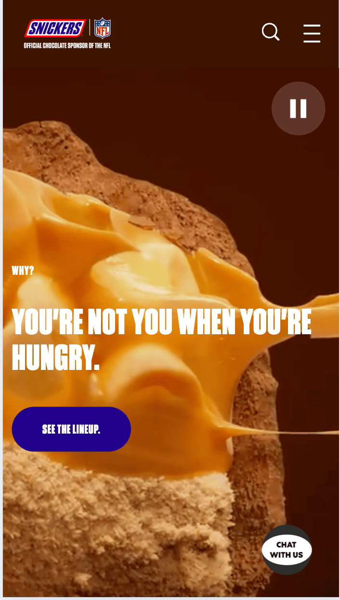

  #### Screenshot(s) van de tweede pagina (small screen):
Aboutpage 
 
 

## Toegankelijkheidstest 1/2 (week 1)

  
uitwerken na test in 2e werkgroep

  ### Bevindingen
  Lijst met je bevindingen die in de test naar voren kwamen:
  - Video kan gestopt worden
  - Elke afbeelding heeft een ALT tekst
- Sommige afbeeldingen hebben een animatie

## Breakdownschets (week 1)
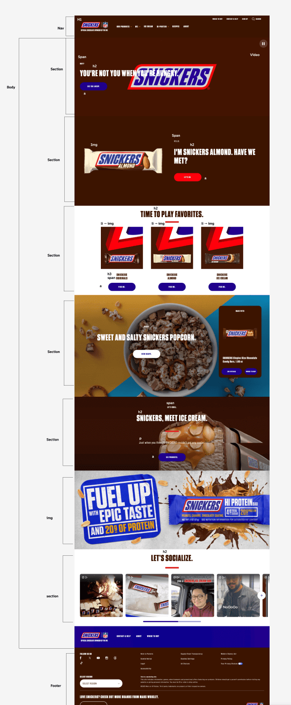

  
uitwerken na afloop 3e werkgroep

  ### de hele pagina: 
  Bij de Snickers-site staat het logo rechtsboven en verschijnt aan de linkerkant een hamburgermenu wanneer je het scherm op iPhone-formaat bekijkt, daaronder staat een video die je kunt pauzeren of afspelen, met tekst en een button die je doorverwijst naar een ander scherm, gevolgd door verschillende secties met advertenties van Snickers-producten. Helemaal onderin is er een footer.
 

  ### dynamisch deel (bijv menu): 
Wanneer het scherm het formaat van een telefoon heeft, verandert de navigatiebalk in een hamburgermenu.

 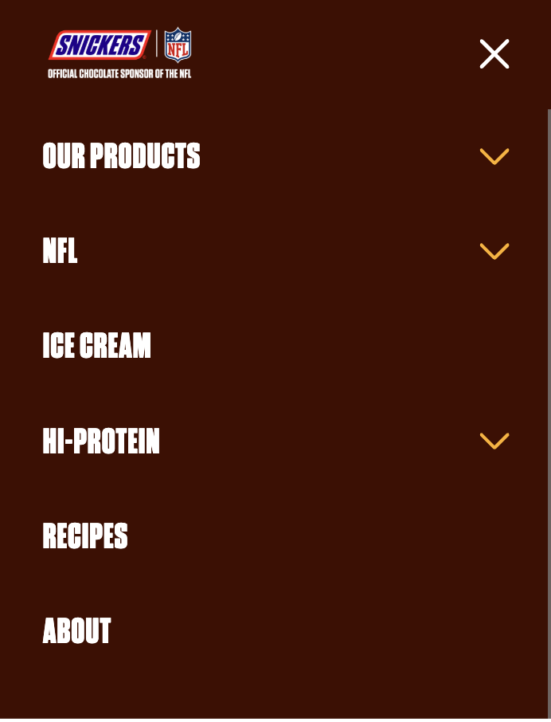

  ### wellicht nog een dynamisch deel (bijv filter): 
De afbeelding heeft een animatie waarbij deze op en neer beweegt, en wanneer je over de button hovert, verandert de kleur van rood naar wit.
   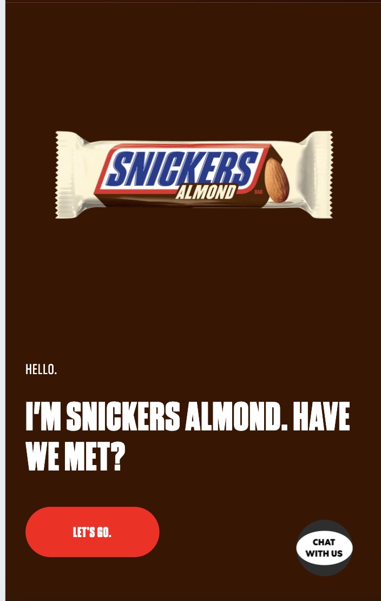

## Voortgang 1 (week 2)

  
uitwerken voor 1e voortgang

  ### Stand van zaken
Ik ben begonnen met het opslaan van alle foto's van de website in mijn mapje en heb vervolgens de indexpagina (de eerste pagina) opgesteld. Het was voor mij nog niet duidelijk wat de H1 moest zijn, dus heb ik dit met de docent besproken om te bepalen wat hiervoor het meest geschikt was.

screenshot van de h1.
 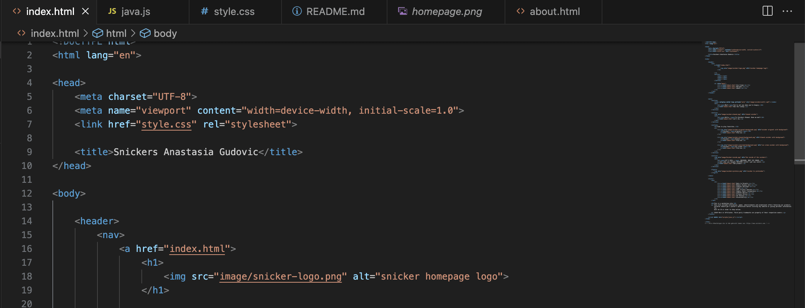

Het was niet moeilijk om alle foto's van de website te halen, al waren sommige afbeeldingen van slechte kwaliteit, waardoor ik goed moest zoeken in de code. Het kostte wat meer tijd om de video van de site te downloaden, omdat deze vastzat in hun database, maar dankzij de extensie die ik heb gebruikt, is het uiteindelijk toch gelukt.

Dit is een screenshot van de video die op de Snickers-website staat. 
 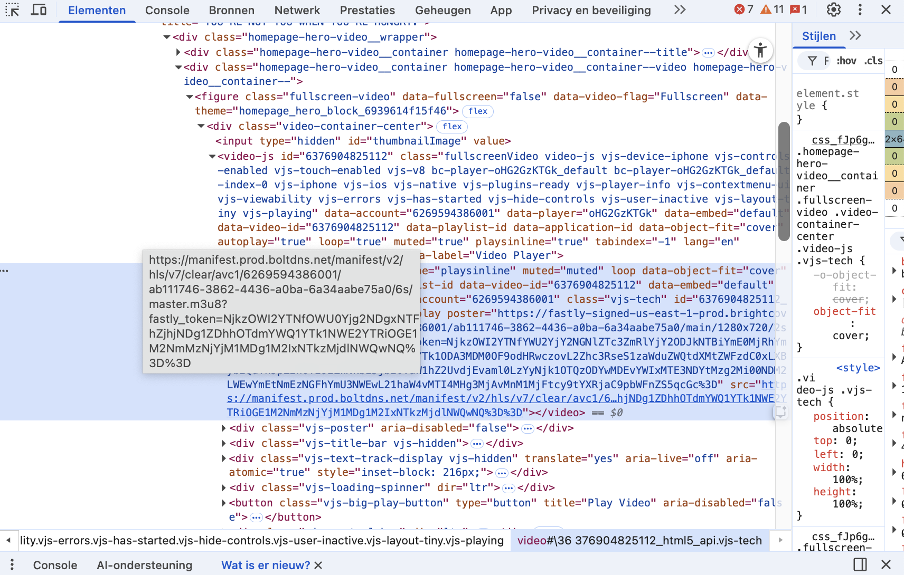

  ### Agenda voor meeting
  samen met je groepje opstellen

Kris:
Bespreken: vragen over zoekbalk

Eme:
Bespreken: Correct gebruik van HTML

Yuzong:
Bespreken: Had geen vragen

Anastasia:
Tijdens het bespreken had ik vragen over wat de H1 op mijn site moest zijn, omdat dit voor mij nog onduidelijk was. Uiteindelijk zijn we tot de conclusie gekomen dat het logo als H1 gebruikt wordt.

  ### Verslag van meeting
  hier na afloop snel de uitkomsten van de meeting vastleggen

**Verduidelijking HTML-elementen** 
We zijn begonnen met het vragen om extra uitleg over een aantal HTML-elementen, vooral over de h1-tag. Het was niet voor iedereen duidelijk wat precies de h1 van een pagina moest zijn. Na verdere toelichting is het voor iedereen helder geworden hoe je bepaalt welke content het beste als h1 gebruikt kan worden.

**Flexbox voor detailpagina's** 
Daarna hebben we doorgevraagd over Flexbox voor het structureren van detailpagina's, omdat we hier allemaal mee te maken krijgen in ons project.

**Structuur: sections en footer** 
Ook zijn er vragen gesteld over wanneer content als losse section moet worden opgenomen en wanneer het juist onderdeel van de footer kan zijn.

**Hamburger-menu** 
We hebben bevestiging gekregen dat een hamburger-menu gemaakt kan worden met een unordered list die vervolgens met CSS en JavaScript interactief wordt gemaakt.

**Zoekfunctionaliteit** 
Daarnaast hebben we gevraagd naar het maken van een zoekbalk, maar dit bleek niet haalbaar binnen dit vak omdat dit vooral backend-kennis vereist.

**Radio buttons voor detailpagina's** 
Tot slot zijn er tips gegeven over het gebruik van radio buttons voor het maken van keuze-opties op detailpagina's.

**Wat ik ga toepassen** 
Voor mijn eigen website neem ik vooral de kennis over het hamburgermenu mee. Ik ga daarnaast de H1 correct verwerken en alle foto's voorzien van alt-teksten. In het begin wist ik niet goed hoe duidelijk deze alt-teksten moesten zijn, maar nu heb ik daar meer inzicht in. Ook had ik tekst met 2 verschillende lettertype, we zijn tot de conclusie gekomen om het best een span te gebruiken binnen de h. 

## Voortgang 2 (week 3)

  
uitwerken voor 2e voortgang

  ### Stand van zaken
Ik ben begonnen met het maken van de eerste pagina en heb alle foto's gekoppeld. Daarbij heb ik goed gekeken welke elementen welke heading-niveaus moesten krijgen. Vervolgens ben ik gestart met het opstellen van mijn CSS. Ik heb een root aangemaakt waarin ik alle kleuren heb gezet die ik ga gebruiken.

Ook wilde ik graag het font van de Snickers-website gebruiken, maar ik had moeite om het lettertype van de site af te halen. Met hulp van de docent is dit gelukt. Vervolgens moest ik het font nog linken in mijn CSS, hierbij had ik wat moeite, maar dankzij de hulp van Valerie is dit uiteindelijk goed gelukt.

 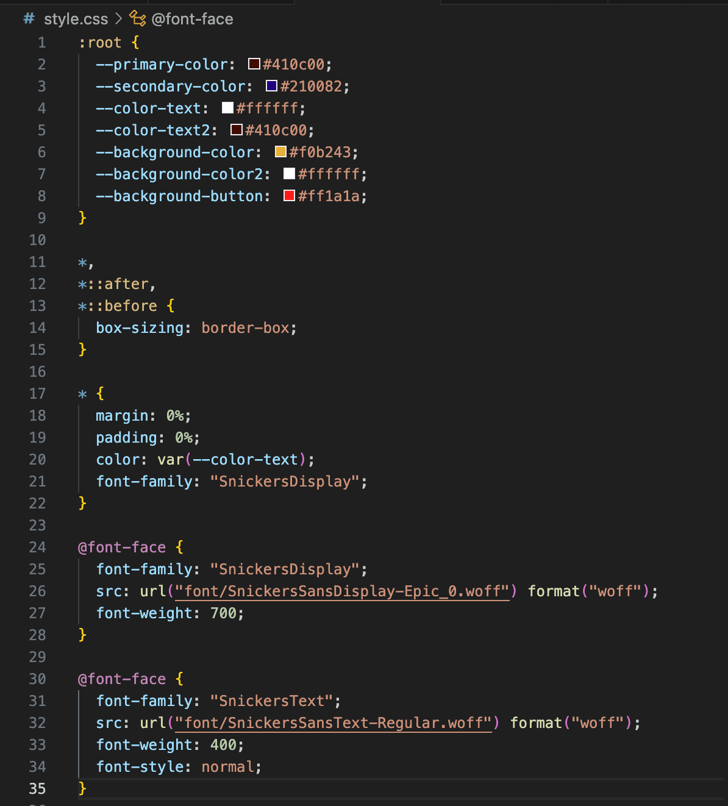

Ook wilde ik een begin maken aan het hamburgermenu, dus heb ik eerst de oefening gemaakt die we hadden gekregen en ben ik daarmee verder gegaan. Ik kreeg nog een kleine error, maar iemand uit het derde jaar heeft mij uitgelegd en geholpen hoe het hamburgermenu werkt. Dankzij die uitleg is het me uiteindelijk gelukt om dit werkend te maken. 

  ### Agenda voor meeting
  samen met je groepje opstellen
  - Kijken hoe ik mijn hamburgermenu kan verbeteren 
  - Hoe ik tekst op afbeelding krijg

  ### Verslag van meeting
  hier na afloop snel de uitkomsten van de meeting vastleggen

  - Ik had mijn hamburgermenu in de main gezet, deze moet in de nav en heb wat tips gekregen hoe ik dit kan verbeteren

## Toegankelijkheidstest 2/2 (week 4)

  
uitwerken na test in 9e werkgroep

  ### Bevindingen
  Lijst met je bevindingen die in de test naar voren kwamen (geef ook aan wat er verbeterd is):

De wcag formulier is belangrijk voor het bekijken van de accesibility van mijn website. Ik heb deze ingevuld en nog kleine aanpassingen gedaan waar het kon.

 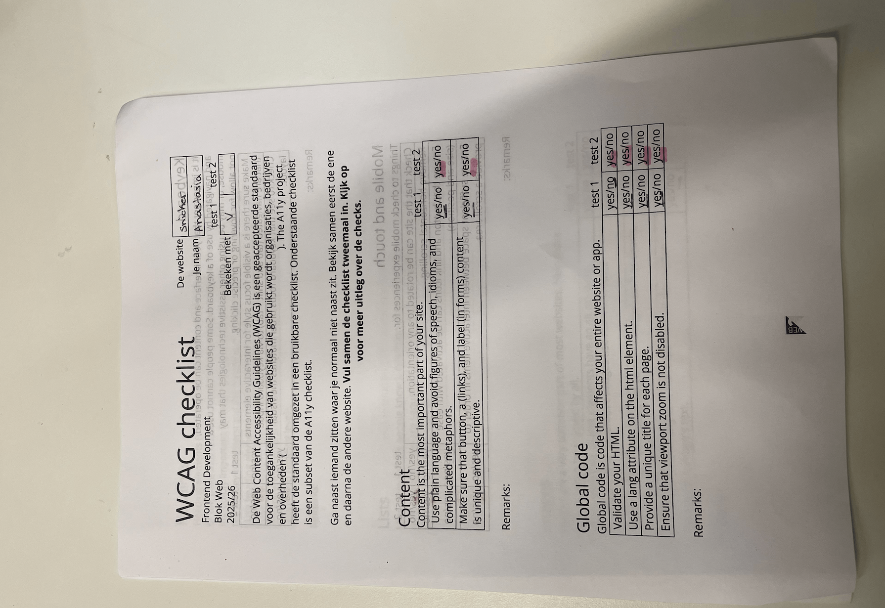

 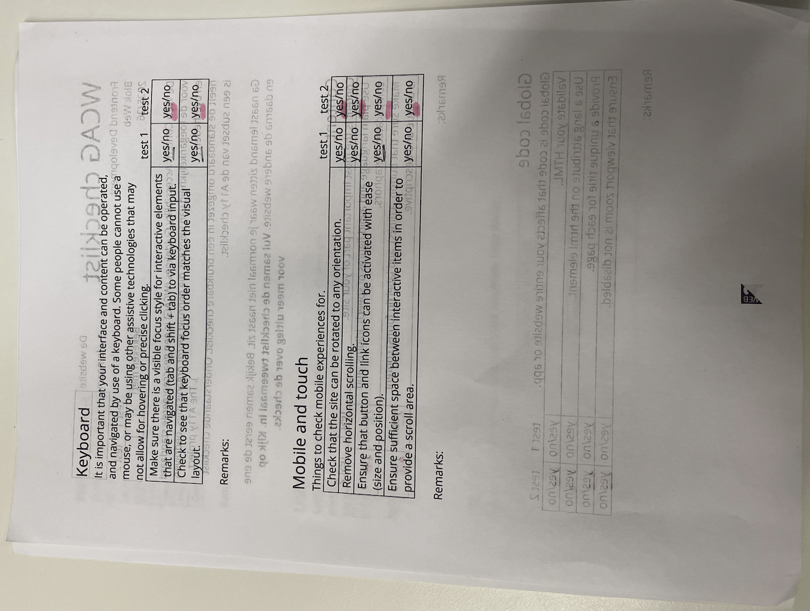

 

 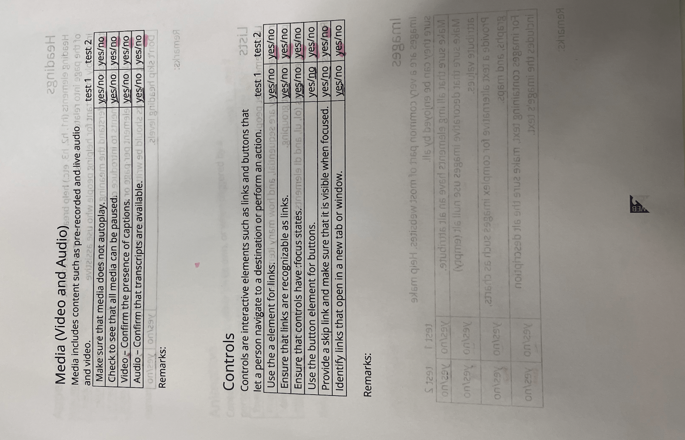

 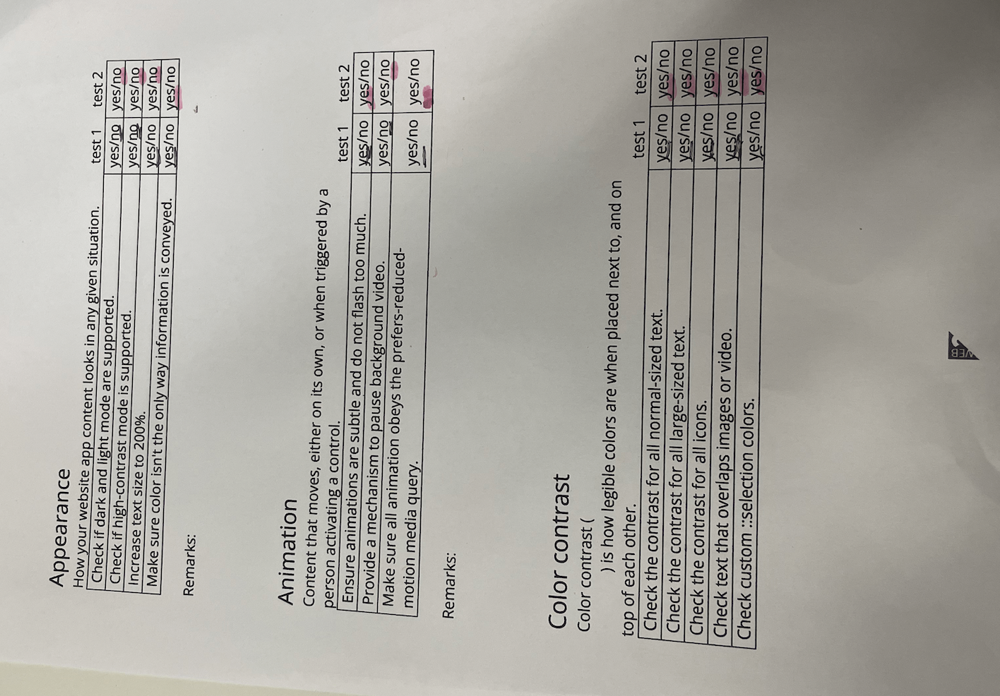

 Tijdens de test kwam ik erachter dat hij bij links alleen links aangaf en niks anders, ik heb toen aria-label toegevoegd zodat screenreaders duidelijk weten waar ze naartoe gaan

## Voortgang 3 (week 4)

  
uitwerken voor 3e voortgang

  ### Stand van zaken
Ik had mijn navigatie eerst in de <main> geplaatst in plaats van in de <header>, dus dat moest ik aanpassen. Verder, wanneer ik op het hamburgermenu klikte en door de pagina scrollde, bewoog het scherm mee. De studentenassistent heeft mij hierbij geholpen: in plaats van dat het menu vastzat, kon je het scherm helemaal naar rechts schuiven en het uitgeklapte menu zien, wat niet de bedoeling was. Dankzij zijn hulp heb ik dit probleem kunnen oplossen.

Hier zie je dat ik nog veel naar rechts kon scrollen, terwijl het scherm eigenlijk al had moeten stoppen.
 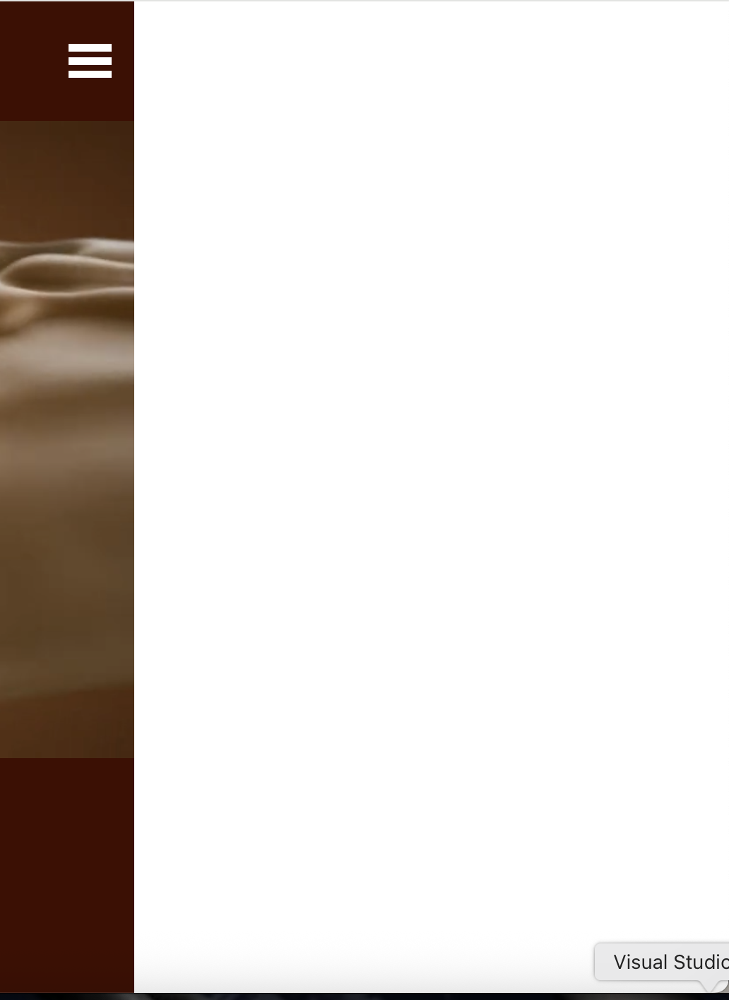

Ik heb ook hulp gekregen bij het plaatsen van tekst op een afbeelding. David liet mij een oefening zien waarin hij dit had gedaan en hielp mij stap voor stap. Hij legde uit dat het het beste is om hiervoor CSS Grid te gebruiken, met grid-template-columns en grid-area

 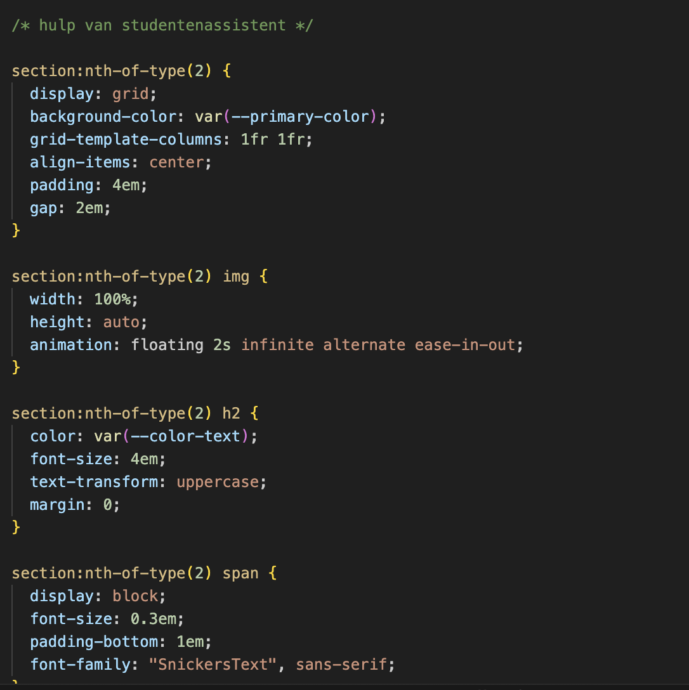

Ik wilde ook dat de tekst en de afbeelding zich aanpassen wanneer het scherm groter of kleiner wordt. David heeft mij hierbij geholpen door uit te leggen hoe ik een @media-regel kan toevoegen in CSS

  ### Agenda voor meeting
  samen met je groepje opstellen
- Hoe ik de tweede pagina het best kan stylen
- Is een stukje in mijn website een section of een nav (zie afbeelding)

 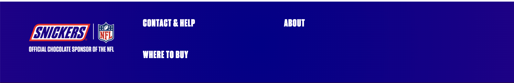

  ### Verslag van meeting
  hier na afloop snel de uitkomsten van de meeting vastleggen

  k had besproken met David dat ik het blauwe gedeelte het beste als navigatie kon gebruiken. Zelf had ik ook moeite met mijn tweede pagina, omdat deze alle stijlen van mijn eerste pagina overnam, ook al gebruikte ik een class. De docent heeft mij geholpen om eerst te controleren welke stijlen werden meegenomen en hoe ik deze kon uitschakelen. Op mijn eerste pagina had ik namelijk gebruikgemaakt van een grid, dat werd dus overgenomen. De docent heeft toen alles opnieuw met een grid opgezet, waardoor het probleem direct opgelost was. Daarna ben ik verder gegaan met het aanpassen van de grootte en de padding.

## Eindgesprek (week 5)

  
uitwerken voor eindgesprek

  ### Je uitkomst - karakteristiek screenshots:
 

Op deze screenshot is mijn volledige website te zien, inclusief het logo, de navigatie, de video met tekst erop en de foto.

 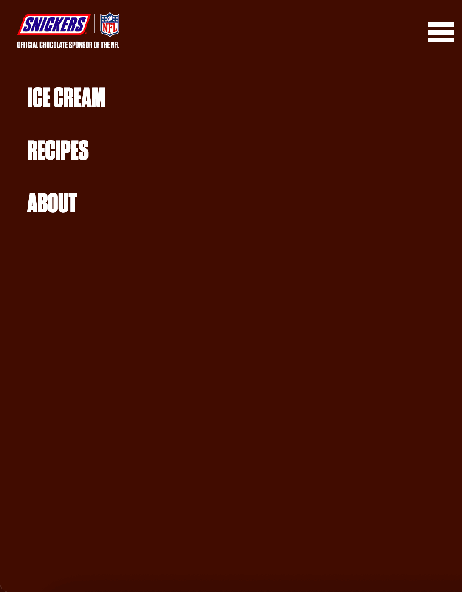

 Hier zie je een screenshot van de uitgeklapte hamburger menu

  ### Dit ging goed/Heb ik geleerd: 
  Korte omschrijving met plaatjes

 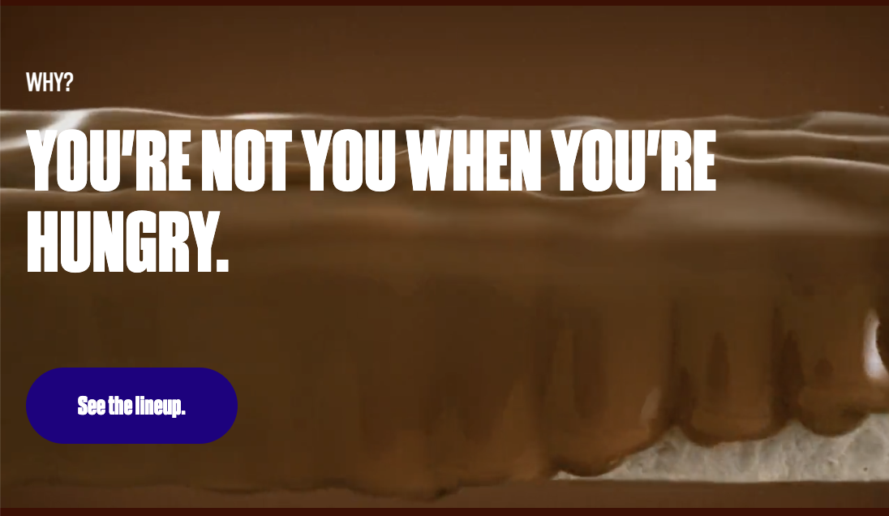

In het begin vond ik het erg moeilijk om tekst op een afbeelding te plaatsen en begreep ik het niet goed. Door de opdrachten te maken en vragen te stellen is het me uiteindelijk toch gelukt. Ondertussen weet ik hoe je CSS Grid kunt gebruiken en waarvoor het allemaal dient, zoals display: grid, grid-template-columns en grid-area. Wel moest ik soms oefenen met het correct toepassen van padding en margin.

Ook weet ik inmiddels een beetje hoe ik @media kan gebruiken en vind ik het leuk om hiermee te werken. Soms krijg ik nog wel een error of weet ik niet precies hoe ik het moet toepassen.

  ### Dit was lastig/Is niet gelukt:
  Korte omschrijving met plaatjes

Mijn website
   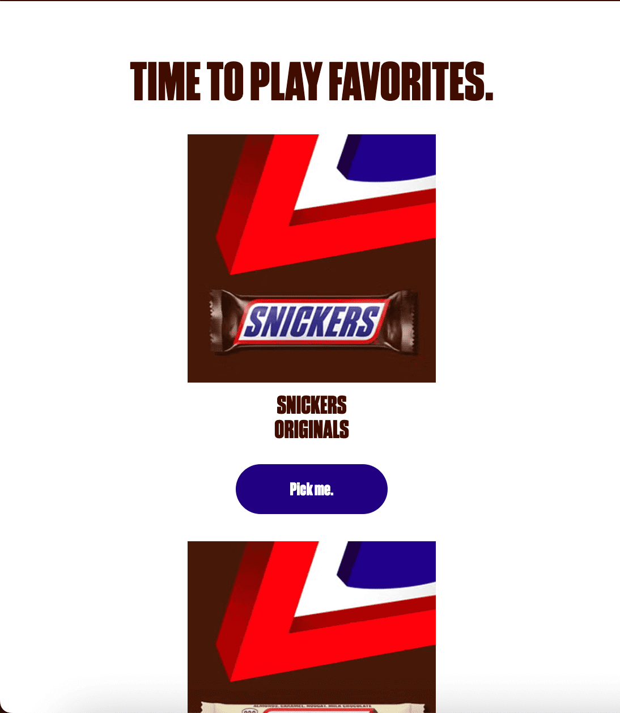

Snicker website
  

Op mijn eigen site heb ik de secties onder elkaar geplaatst, wat er anders uitziet dan op de echte website. Ik wilde namelijk dat je de foto’s van links naar rechts kon swipen. Hiervoor was ook een oefening beschikbaar, die ik heb gemaakt en toegepast op mijn website. Het werkte, maar er ontstond te veel witruimte, waardoor het er niet mooier uitzag, zelfs met gebruik van padding en margin. Omdat het resultaat nog niet naar wens was, heb ik besloten de foto’s onder elkaar te zetten. Dit is minder mooi, maar het werkt wel en ziet er nog steeds redelijk goed uit. Als ik meer tijd had, zou ik hier verder op oefenen en kijken hoe ik het op een betere manier kan doen.

## Bronnenlijst

  
continu bijhouden terwijl je werkt

  Nb. Wees specifiek ('css-tricks' als bron is bijv. niet specifiek genoeg). 
  Nb. ChatGpT en andere AI horen er ook bij.
  Nb. Vermeld de bronnen ook in je code.

 1. Alle afbeelding en content zijn van de Snicker website: https://www.snickers.com/
 2. Hamburger menu hulp gekregen van de derde jaar.
 3. Oefening van Code pen die we in de les hebben gekregen
 4. Hulp van Studentenassistent van Maya en David
 5. isibility: hidden; komt van chat.gtp "hoe zorg ik ervoor dat mijn hamburgermenu niet steeds meebeweegt?

